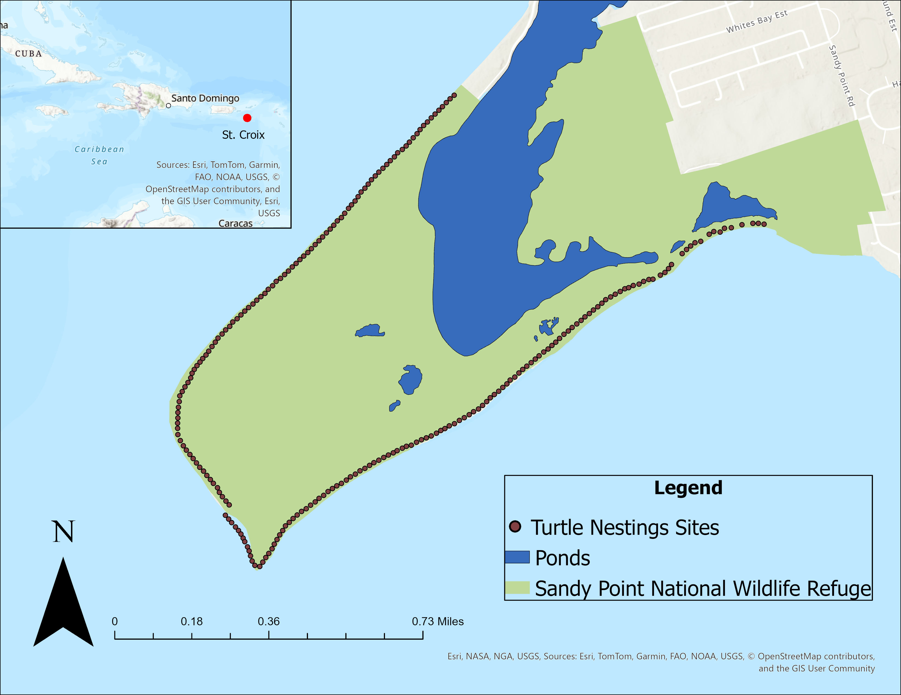

```{r setup, include=FALSE}
knitr::opts_chunk$set(echo = TRUE)

```

## Study Site

Sandy Point National Wildlife Refuge (SPNWR) in St. Croix, U.S. Virgin Islands, has one of the longest research and recovery programs for nesting leatherbacks under United States jurisdiction. Data from 44 years (1981-2025) worth of leatherback nesting data obtained from nightly monitoring at the Refuge and assessed for reproductive longevity, size at sexual maturity, and post maturation growth rates.

```{r map, echo=FALSE, out.width="70%"}


```

## Reproductive Longevity
The mean reproductive longevity was estimated to be 8.1 years, with a maximum of 31 years. The average estimate obtained in this study is similar to those found using skeletochronology in the same region. The maximum estimate for reproductive longevity at Sandy Point is larger than estimates found in previous studies.

```{r longevity, echo=FALSE, message=FALSE, warning=FALSE}
library(dplyr)
library(lubridate)
library(readr)
library(tidyverse)
library(stringr)
library(knitr)
library(kableExtra)


DcDataRemoved <- read_csv("~/R/Projects/Thesis/data/DcDataRemoved.csv")


# clean rows so we are only looking at the nest lays
clean_df <- DcDataRemoved %>%
  mutate(results_clean = str_to_lower(str_trim(Result))) %>%
  filter(results_clean %in% c("relocate", "lay", "probable lay", "in situ")) %>%
  select(-results_clean)


#separate dates into individual columns

DcDates <- clean_df %>%
  mutate(DateOfActivity = mdy(DateOfActivity),  # convert to Date type
         month = month(DateOfActivity),
         day   = day(DateOfActivity),
         year  = year(DateOfActivity))


#remove values +/- 1 cm different in same yr

filtered_df <- DcDates %>%
  mutate(Year = year(DateOfActivity)) %>%
  group_by(OriginalTagID, Year) %>%
  arrange(DateOfActivity) %>%
  mutate(first_CCL = first(CurvedCarapaceLength_NtoN)) %>%
  filter(abs(CurvedCarapaceLength_NtoN - first_CCL) <= 1) %>%
  ungroup()

# Per-turtle longevity
turtle_longevity <- filtered_df %>%
  group_by(OriginalTagID) %>%
  summarise(
    first_year = min(year(DateOfActivity), na.rm = TRUE),
    last_year  = max(year(DateOfActivity), na.rm = TRUE),
    longevity  = last_year - first_year,
    .groups = "drop"
  )


# Overall summary (excluding turtles with longevity = 0)

newlongevity_summary <- turtle_longevity %>%
  filter(longevity > 0) %>%
  summarise(
    Mean   = mean(longevity, na.rm = TRUE),
    Median = median(longevity, na.rm = TRUE),
    Min    = min(longevity, na.rm = TRUE),
    Max    = max(longevity, na.rm = TRUE),
    SD     = sd(longevity, na.rm = TRUE)
  )

# table
newlongevity_summary %>%
  kable(
    caption = "Leatherback Reproductive Longevity",
    digits = 2,
    format = "html",
    align = "c"
  ) %>%
  kable_styling(
    bootstrap_options = c("striped", "hover", "condensed", "responsive"),
    full_width = FALSE,
    position = "center",
    font_size = 16
  ) %>%
  row_spec(0, bold = TRUE, background = "#D3D3D3") %>%
  column_spec(1:ncol(newlongevity_summary), border_left = TRUE, border_right = TRUE)


```


## Size at Sexual Maturity
The mean size of sexual maturity was estimated to be 150.5 cm (CCL), with a total range of 127.6-176.0 cm (CCL). The size of sexual maturity found in this study was higher than estimates previously identified from growth curves based on skeletochronology. 
```{r size, echo=FALSE}
DcDates <- clean_df %>%
  mutate(DateOfActivity = mdy(DateOfActivity),  # convert to Date type
         month = month(DateOfActivity),
         day   = day(DateOfActivity),
         year  = year(DateOfActivity))


#remove values +/- 1 cm different in same yr

filtered_df <- DcDates %>%
  mutate(Year = year(DateOfActivity)) %>%
  group_by(OriginalTagID, Year) %>%
  arrange(DateOfActivity) %>%
  mutate(first_CCL = first(CurvedCarapaceLength_NtoN)) %>%
  filter(abs(CurvedCarapaceLength_NtoN - first_CCL) <= 1) %>%
  ungroup()


# Find each turtle's first nesting year
first_nesting <- filtered_df %>%
  group_by(OriginalTagID) %>%
  summarise(first_year = min(year(DateOfActivity), na.rm = TRUE),
            .groups = "drop")


# Keep only rows from the first nesting year
first_year_data <- filtered_df %>%
  mutate(Year = year(DateOfActivity)) %>%
  inner_join(first_nesting, by = "OriginalTagID") %>%
  filter(Year == first_year)


# calculate size at sexual maturity
size_summary <- first_year_data %>%
  summarise(
    min_CCL  = min(CurvedCarapaceLength_NtoN, na.rm = TRUE),
    mean_CCL = mean(CurvedCarapaceLength_NtoN, na.rm = TRUE),
    max_CCL  = max(CurvedCarapaceLength_NtoN, na.rm = TRUE),
    
    min_CCW  = min(CurvedCarapaceWidth, na.rm = TRUE),
    mean_CCW = mean(CurvedCarapaceWidth, na.rm = TRUE),
    max_CCW  = max(CurvedCarapaceWidth, na.rm = TRUE)
  )


# Overall summary (excluding turtles with longevity = 0)

size_summarytable <- first_year_data %>%
  summarise(
    Minimum   = min(CurvedCarapaceLength_NtoN, na.rm = TRUE),
    Mean    = mean(CurvedCarapaceLength_NtoN, na.rm = TRUE),
    Maximum    = max(CurvedCarapaceLength_NtoN, na.rm = TRUE)
  )

# table
size_summarytable %>%
  kable(
    caption = "Leatherback Size at Sexual Maturity (CCL)",
    digits = 2,
    format = "html",
    align = "c"
  ) %>%
  kable_styling(
    bootstrap_options = c("striped", "hover", "condensed", "responsive"),
    full_width = FALSE,
    position = "center",
    font_size = 16
  ) %>%
  row_spec(0, bold = TRUE, background = "#D3D3D3") %>%
  column_spec(1:ncol(size_summarytable), border_left = TRUE, border_right = TRUE)


#plot size at sexual maturity across years
ggplot(first_year_data, aes(x = first_year, y = first_CCL)) +geom_jitter()+
  labs(
    x = "Year",
    y = "Size at Sexual Maturity: CCL (cm)",
    title = "Change in Size at Sexual Maturity across years"
  ) +
  theme_minimal()

```

## Post Maturation Growth Rates Across Decades
After the onset of sexual maturity, growth rates for leatherback sea turtles have been found to decrease. At Sandy Point, the post-maturity annual growth rate was estimated to be 0.1 cm/yr (CCL) which is consistent with findings from other mark-recapture studies. Further investigation of post-maturation growth rates at Sandy Point revealed no significant difference in growth rates between turtles that have nested 10 yeas or less, 10-20 years, or for over 20 years (H = 3.5864, p = 0.1664).
.

```{r growth, echo=FALSE}

# Find each turtle's first nesting year
first_nesting <- filtered_df %>%
  group_by(OriginalTagID) %>%
  summarise(first_year = min(year(DateOfActivity), na.rm = TRUE),
            .groups = "drop")

# Keep only rows from the first nesting year
first_year_data <- filtered_df %>%
  mutate(Year = year(DateOfActivity)) %>%
  inner_join(first_nesting, by = "OriginalTagID") %>%
  filter(Year == first_year)

# calculate size at sexual maturity
size_summary <- first_year_data %>%
  summarise(
    min_CCL  = min(CurvedCarapaceLength_NtoN, na.rm = TRUE),
    mean_CCL = mean(CurvedCarapaceLength_NtoN, na.rm = TRUE),
    max_CCL  = max(CurvedCarapaceLength_NtoN, na.rm = TRUE),
    
    min_CCW  = min(CurvedCarapaceWidth, na.rm = TRUE),
    mean_CCW = mean(CurvedCarapaceWidth, na.rm = TRUE),
    max_CCW  = max(CurvedCarapaceWidth, na.rm = TRUE)
  )


#binned growth rate

OverTen <- filtered_df %>%
  group_by(OriginalTagID) %>%
  filter(max(year(DateOfActivity), na.rm = TRUE) - 
           min(year(DateOfActivity), na.rm = TRUE) >= 10) %>%
  ungroup()

growth_rates <- OverTen %>%
  arrange(OriginalTagID, DateOfActivity) %>%
  group_by(OriginalTagID) %>%
  mutate(
    prev_CCL  = lag(CurvedCarapaceLength_NtoN),
    prev_date = lag(DateOfActivity),
    days_elapsed = as.numeric(difftime(DateOfActivity, prev_date, units = "days")),
    growth_rate = (CurvedCarapaceLength_NtoN - prev_CCL) / days_elapsed * 365.25,
    years_since_first = as.numeric(difftime(DateOfActivity, min(DateOfActivity, na.rm = TRUE), units = "days")) / 365.25
  ) %>%
  filter(!is.na(growth_rate) & days_elapsed > 0) %>%
  ungroup()

growth <- growth_rates %>%
  filter(growth_rate > -1)

growth_rates_bins_cleaned <- growth %>%
  mutate(
    growth_phase = case_when(
      years_since_first >= 1  & years_since_first <= 10 ~ "Years 1–10",
      years_since_first >= 11 & years_since_first <= 20 ~ "Years 11–20",
      years_since_first >= 21 & years_since_first <= 31 ~ "Years 21–31",
      TRUE ~ NA_character_
    )
  ) %>%
  filter(!is.na(growth_phase))

summary_stats <- growth_rates_bins_cleaned %>%
  group_by(growth_phase) %>%
  summarise(
    mean_rate = mean(growth_rate, na.rm = TRUE),
    se_rate   = sd(growth_rate, na.rm = TRUE) / sqrt(n())
  )


growth_rates_bins_cleaned$growth_phase <- factor(
  growth_rates_bins_cleaned$growth_phase,
  levels = c("Years 1–10", "Years 11–20", "Years 21–31")
)


ggplot(growth_rates_bins_cleaned,
       aes(x = growth_phase, y = growth_rate, fill = growth_phase)) +
  geom_violin(trim = FALSE, alpha = 0.4) +
  geom_jitter(
    aes(color = growth_phase),
    width = 0.15, 
    alpha = 0.4, 
    size = 1
  ) +
  stat_summary(fun = "median", geom = "point", size = 3, color = "black") +
  labs(
    x = "Nesting year phase", 
    y = "Growth rate (cm yr⁻¹)",
    title = "Growth rate across nesting years"
  ) +
  theme_minimal() +
  theme(legend.position = "none")

```
